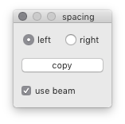
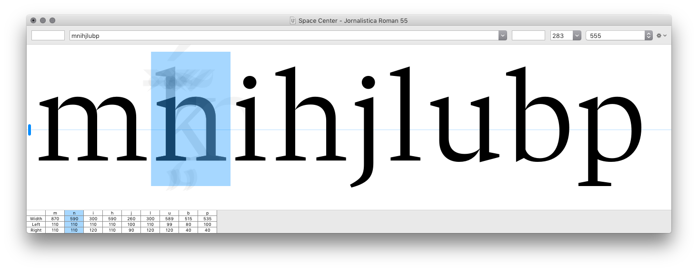

Group Spacing
=============

A RoboFont extension to enable group spacing in the Space Center.

- create left and right spacing groups using the [Groups Editor]
- current glyph in [Space Center] shows all other glyphs in the same spacing group
- transfer margins from selected glyph to all other glyphs in group
- optionally use the Space Center’s beam to measure margins
- import/export spacing groups to json file

[Groups Editor]: http://robofont.com/documentation/workspace/groups-editor/
[Space Center]: http://robofont.com/documentation/workspace/space-center
