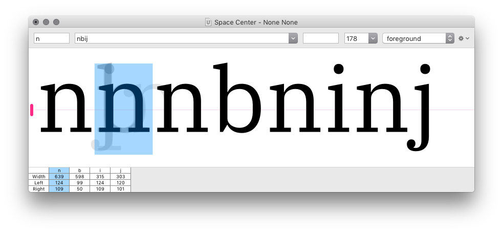

Group Spacing
=============

A simple tool to enable group spacing in RoboFont.

- create left and right spacing groups using the [Groups Editor]
- works together with the selected glyph in the [Space Center]
- shows a preview of all other glyphs in the same spacing group
- allows you to transfer margins from the current glyph to all other glyphs in the same group
- supports margin measurements using the current beam

Name spacing groups using the standard prefixes:

- `groupSpacing.left.`
- `groupSpacing.right.`

<!--
How to use it
-------------

1. Create left and right spacing groups using the [Groups Editor]:

    

    Name the groups using the standard prefixes:

    - `groupSpacing.left.`
    - `groupSpacing.right.`

    …or modify the code to use a different prefix scheme if you wish.

2. Open some glyphs in the [Space Center].

3. Open the Group Spacing tool by running the script `groupSpacing.py`:

    

    Choose between left- or right-side spacing class.

4. Click on one glyph: if this glyph belongs to a spacing group, the other glyphs in this group are displayed in the background.

    

5. Use the preview to check if the other glyphs in the spacing group are aligned. Adjust the margins of the selected glyph if needed.

6. Click on the *copy* button to transfer the left or right margin from the current glyph to all other glyphs in the spacing group. Select the `beam` option to measure margins using the current Space Center’s beam.

    

To Do
-----

- test with composed glyphs, italics
- add option to copy margins automatically?
- add *copy to left siblings* and *copy to right siblings* as menu shortcuts?
-->

[Groups Editor]: http://robofont.com/documentation/workspace/groups-editor/
[Space Center]: http://robofont.com/documentation/workspace/space-center