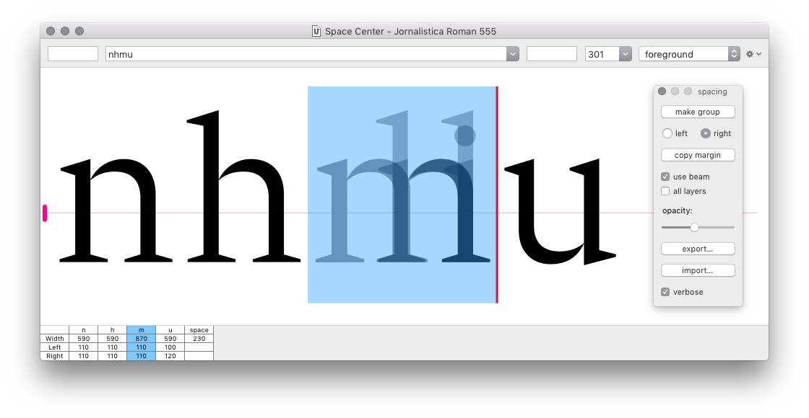

Group Spacing
=============

A RoboFont extension to enable group spacing in the Space Center.

- create left/right kerning groups using the [Groups Editor]
- the selected glyph in [Space Center] displays an overlay of all glyphs in the same left/right kerning group
- use the button to transfer margins from the selected glyph to all other glyphs in the group
- optionally use the Space Center’s beam to measure margins and/or copy margins to all glyph layers
- spacing groups can be imported from and exported to `.json` format

[Groups Editor]: http://robofont.com/documentation/workspace/groups-editor/
[Space Center]: http://robofont.com/documentation/workspace/space-center

- - -

### Known bugs

- not working in Single Window Mode
